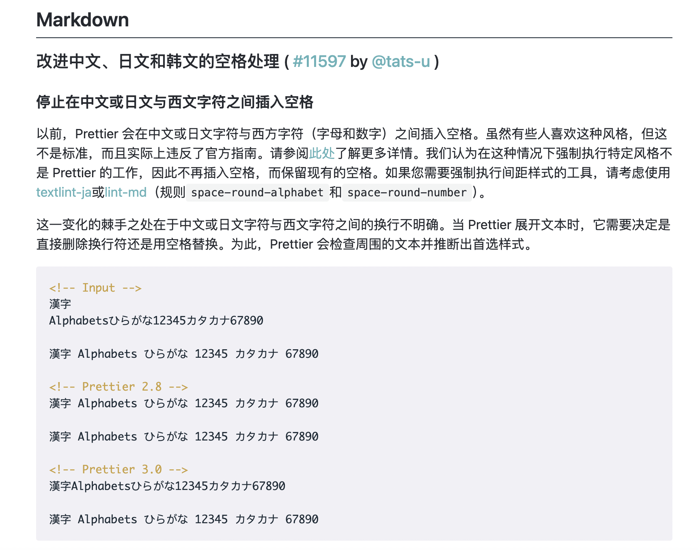
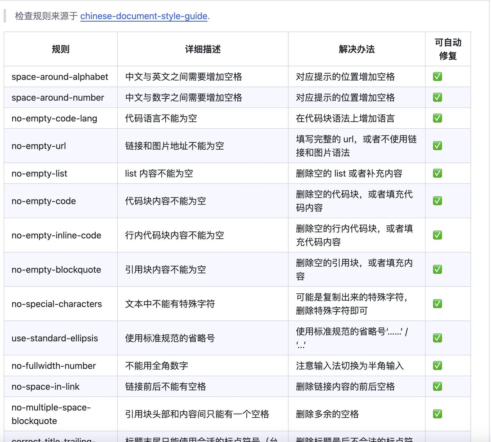
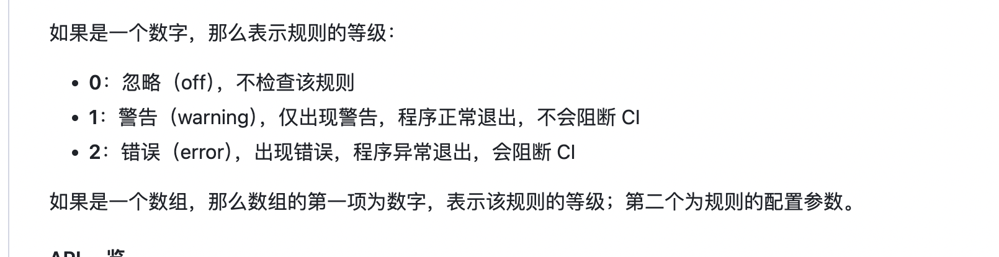

# prettier-plugin-lint-md


why？

[Prettier 3.0](https://prettier.io/blog/2023/07/05/3.0.0.html#stop-inserting-spaces-between-chinese-or-japanese-and-western-characters) 有需要变动，其中有一条将不会自动在中英文符号插入空格提高可读性。



虽然从使用群体来说 Prettier 这个决定没有什么问题，不过确实也会导致编写起来会存在很多不便，所有就有了这个插件。

> 还有一些其他讨论：
> [Markdown: Add an option to re-enable Prettier 2.x's automatic space insertion in CJK](https://github.com/prettier/prettier/issues/15015)

## 工作原理

[lint-md](https://github.com/lint-md/lint-md) 是检查中文 Markdown 编写格式的工具，让你的文档更加优雅规范。

它内置了许多检查



具体就是[阮一峰写的中文技术文档的写作规范](https://github.com/ruanyf/document-style-guide)

这个插件就是结合 Prettier 让你在编写的过程中实时修订错误。

```txt
编写md  => 发现问题 => lint-md 修订 => prettier 格式化 => 输出
```

## 使用

```sh
npm i prettier-plugin-lint-md -D
# or
yarn i prettier-plugin-lint-md -D
# pnpm
pnpm add prettier-plugin-lint-md -D
```

在 Prettier 支持的配置文件，例如 `.prettierrc.mjs`

```js
export default {
  // ...
  plugins: [`prettier-plugin-lint-md`],
};
```

### Node 调用

```ts
import prettierPluginLintMd, { PARSER_NAME } from 'prettier-plugin-lint-md';
import { format } from 'prettier';

const result = await format(code, {
  parser: PARSER_NAME,
  plugins: [prettierPluginLintMd],
});
```

更多使用场景可以参考 [**test**](./__test__/) 目录。

## 配置

**初始情况下已经包含了预设规则，所以确定你有需要调整的规则可以继续往下阅读。**

lint-md 支持 `.lintmdrc` JSON 文件，`prettier-plugin-lint-md` 同样也支持，只需要在配置文件传递 `configFile` 即可。

```js
// .prettierrc.mjs
export default {
  // ...
  plugins: [`prettier-plugin-lint-md`],
  configFile: '.lintmdrc',
};
```

> 默认会自动检测 `.lintmdrc` 文件，所以默认情况下你可以不需要传递，但是如果你想定义其它名称则需要传递，`.lintmdrc` 可以是一个绝对路径也可以是相对路径。

还有上面列举的一系列规则也同样支持，在 `.prettierrc.mjs` 直接写入即可，例如

```js
// .prettierrc.mjs
export default {
  // ...
  plugins: [`prettier-plugin-lint-md`],
  'space-around-alphabet': false,
};
```

这里需要注意，除了 `configFile` 其他都是 `boolean`，虽然规则本身的值是下面


但是这些是 CLI 中使用的，在 prettier 中则需要 `true` 和 `false` 即可。

> configFile 配置会被手动传递的覆盖。

## 协议

MIT License
